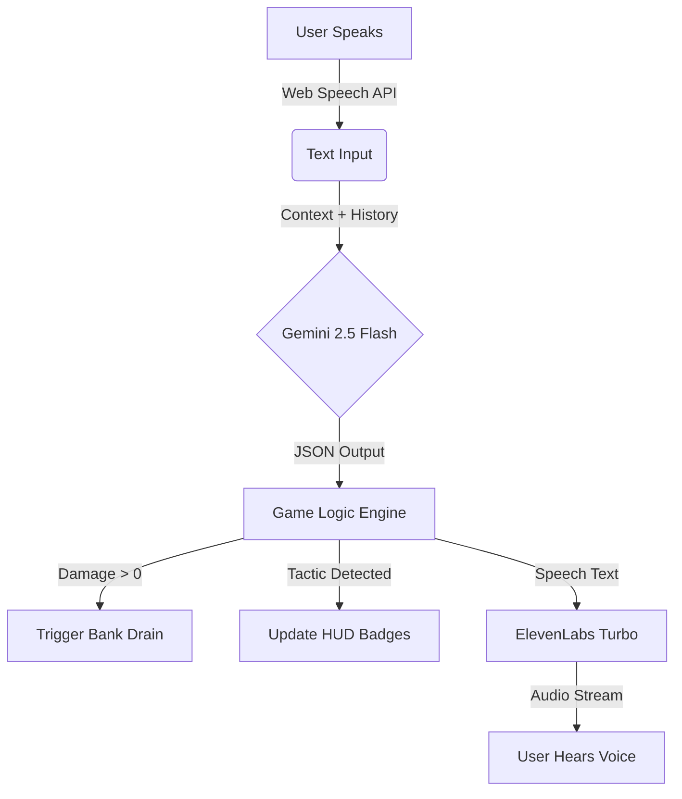

# 🛡️ Vigilante: Neural Intercept

> **The AI-Powered Social Engineering Defense Simulator.** \> *A "Fire Drill" for your phone that trains you to survive voice phishing attacks.*

-----

## The Problem

Global losses from voice phishing (Vishing) and social engineering scams exceeded **$1 Trillion** last year. The most vulnerable populations (elderly, non-technical) lack safe, realistic ways to practice defense. Static training videos fail because they lack the **emotional pressure** of a real scam call.

## The Solution

**Vigilante** is a gamified simulator that "attacks" the user with realistic AI-generated voice scams.
Unlike standard chatbots, Vigilante is a **State Machine Game**:

  * **Dynamic Scenarios:** No scripts. Gemini generates a unique persona (e.g., "IRS Audit", "Kidnapping") every time the phone rings.
  * **Discernment Training:** The AI randomly injects **Genuine Calls** (e.g., real bank fraud alerts), forcing users to decide: *Hang Up* or *Verify*?
  * **Active Countermeasures:** Users can deploy **"Honeypot" Decoy Data** (fake credit card numbers) to waste the scammer's time.

-----


## Tech Stack

### **AI & Logic**

  * **Google Gemini 2.5 Flash:** Acts as the "Scenario Engine" and Game Master. It outputs structured JSON to control game state (Damage, Trust Score, Tactic Detection).
  * **ElevenLabs Turbo v2.5:** Provides ultra-low latency voice synthesis. We programmatically adjust `stability` parameters:
      * *Scammers* = `0.3` (Jittery, Aggressive)
      * *Genuine Agents* = `0.9` (Stable, Professional)

### **Frontend & Interface**

  * **React + Vite:** For high-performance rendering.
  * **Tailwind CSS:** "Cyber-Warfare" aesthetic (CRT scanlines, monospaced fonts, glowing vectors).
  * **Web Speech API:** Native browser speech recognition for zero-latency input.

### **Infrastructure (Hackathon Tracks)**

  * **LiquidMetal Raindrop:** Backend logic defined in `liquidmetal.yaml` for session state management.
  * **Vultr Cloud Compute:** Application containerized via `Dockerfile` for high-performance global deployment.

-----

## Features

### 1\. The "Neural Persona" Engine

The app masks AI latency by generating the caller's profile (Name, Goal, Aggression Level) while the "Incoming Call" screen is ringing.

### 2\. Real-Time Consequence Engine

If the user panics and reveals sensitive info (like "Yes, my password is..."), the AI parses this intent and instantly:

  * Drains the simulated **Bank Balance**.
  * Triggers a realistic **System Alert Notification**.

### 3\. "Honeypot" Decoy Module

A tactical HUD feature that generates valid-format (but fake) credit card details. Users can read these to the AI to "win" the encounter by wasting the scammer's time.

-----

## Installation & Setup

1.  **Clone the Repo**

    ```bash
    git clone https://github.com/yourusername/vigilante-voice-defense.git
    cd vigilante-voice-defense
    ```

2.  **Install Dependencies**

    ```bash
    npm install
    ```

3.  **Configure Environment**
    Create a `.env` file in the root directory:

    ```env
    VITE_GEMINI_KEY=your_google_ai_key_here
    VITE_ELEVENLABS_KEY=your_elevenlabs_key_here
    ```

4.  **Run Locally**

    ```bash
    npm run dev
    ```

-----

## Architecture



-----

## Deployment

### **Vultr / Docker**

This project includes a production-ready `Dockerfile`.

```bash
docker build -t vigilante-app .
docker run -p 80:80 vigilante-app
```

### **Raindrop**

Session logic is configured via `liquidmetal.yaml`:

```yaml
services:
  - name: scenario-engine
    runtime: node:18
    environment:
      GEMINI_MODEL: "gemini-2.5-flash"
```

-----

## Hackathon Tracks

  * **🌍 Best AI Solution for Public Good:** Democratizing high-fidelity security training for vulnerable populations.
  * **🎙️ Best Voice Agent (ElevenLabs):** Using emotional variance parameters to simulate panic and aggression.
  * **💡 Best Solopreneur App:** Full-stack simulation built by a single developer.

-----

## License

Distributed under the MIT License. See `LICENSE` for more information.